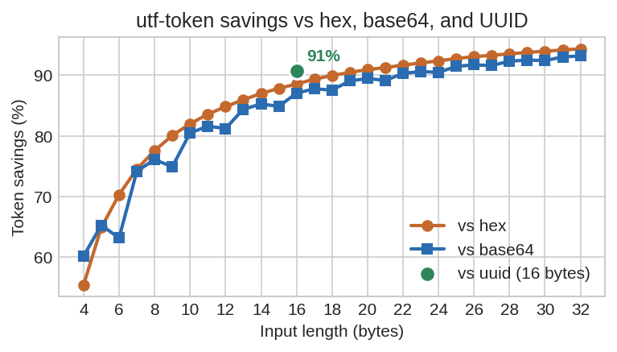

# utf-token

Convert random string identifiers to a LLM-friendly format to reduce token usage in certain retrieval and agentic tasks.

`utf-token` encodes the identifier into a 2-token sequence by default with 30 bits of entropy. Collisions are prevented automatically and the conversion is fully reversible.



## Install

```shell
uv add utf-token
```

## Usage

The `IdTokenBiMap` class is used to encode identifiers and store the full original bytes so you can recover them later.

```python
from utf_token import IdTokenBiMap

bimap = IdTokenBiMap()

hex_str = "215aada34d0987ebfb9de132d913e46b"
# 17 tokens: 215 a ada 34 d 098 7 eb fb 9 de 132 d 913 e 46 b

token_hex = bimap.fromhex(hex_str)
print(token_hex)
# 2 tokens: ao 691

reconstructed_hex = bimap.tohex(token_hex) # Recovers the original hex string
```

Forward methods: `frombytes`, `fromhex`, `frombase64`, `fromuuid`.
Reverse methods: `tobytes`, `tohex`, `tobase64`, `touuid`.

Both forward and reverse methods accept either:

- a single value -> returns one encoded `str` (or recovered value)
- an iterable of values -> returns a lazy iterator

### Persisting the reversible map

The internal map in `IdTokenBiMap` can be saved and restored to transfer offline conversions for online usage:

- `to_dict` / `from_dict`
- `to_json` / `from_json`

## Optional arguments

### LLM - token vocabulary pairing

Pick the token vocabulary that matches the model you are using. Current options are:

- Default: `o200k` (OpenAI GPT-5+)
- `gemma4` (Google Gemma 4)

```python
bimap = IdTokenBiMap(vocab="gemma4")
```

### Controlling how many bits are encoded with `keep_bits`

`IdTokenBiMap` takes `keep_bits` at construction (default **30**):

- a positive integer that is a multiple of the vocab's `pair_index_bits` (15 for shipped vocabs): you get 1 token per 15 bits
- `None` or `"all"`: encode the full input

```python
short_bimap = IdTokenBiMap()                                     # keep_bits=30
longer_bimap = IdTokenBiMap(keep_bits=45)
full_bimap = IdTokenBiMap(keep_bits="all")

short = short_bimap.frombytes(b"\x01\x02\x03\x04\x05\x06")
short_bimap.tobytes(short) == b"\x01\x02\x03\x04\x05\x06"        # reverse returns the full input
```

The default 30 bits (two full 15-bit chunks) is enough entropy for retrieval workloads where you only need a handful of distinct identifiers visible to the model at once, and is also the minimum we recommend for the healing logic described below to stay reliable. Use a larger multiple of 15 if you need more in-context disambiguation.

### Healing transcription errors on reverse lookup

LLMs occasionally make transcription errors when copying identifiers. Reverse methods accept an `errors` keyword to control what happens when the input is not an exact match in the reverse map:

- `errors="fix"` (default): return the closest previously encoded identifier by Levenshtein distance.
- `errors="raise"`: if the exact lookup misses, raise `KeyError`. Useful when you want to manage error handling yourself.

```python
bimap = IdTokenBiMap()
encoded = bimap.fromuuid("123e4567-e89b-12d3-a456-426614174000")

bimap.touuid(encoded)                                    # exact match
bimap.touuid(encoded[:-1] + "Z")                         # heals to nearest stored id

bimap.touuid("not_a_real_id", errors="raise")            # raises KeyError

if encoded in bimap:                                     # supports membership checks
    print("This will print")
```

## Standalone forward-only helpers

`frombytes`, `fromhex`, `frombase64`, and `fromuuid` are also available as standalone module-level functions. They perform only the forward conversion, and they default to keeping the full input rather than truncating. They are useful when you want to plug `utf-token` into your own data flow or build your own reverse-lookup table:

```python
from utf_token import fromhex

my_hex = "215aada34d0987ebfb9de132d913e46b"
encoded_hex = fromhex(my_hex)                            # full input
short_hex = fromhex(my_hex, keep_bits=30)                 # top 30 MSBs
```

Both `keep_bits=None` and `keep_bits="all"` keep the full input.

For the standalone functions, pass the `vocab` parameter in the call.

## Included safe character set in tokens

Both `o200k` and `gemma4` lookup tables are restricted to ASCII (`A-Z`, `a-z`, `0-9`, `_`) to avoid LLM confusion.

Neither vocabulary emits quotes, slashes, brackets, commas, pipes, whitespace, or other delimiter characters, which makes the output easy to embed in JSON, Markdown, logs, tables, and prompts where the LLM or code needs to see clearly where an identifier begins and ends.

### Instructions to include in prompts/tools

To avoid confusion when your agent sees these IDs, you can adapt these instructions to your specific use case:

> Identifiers are random LLM token sequences containing only ASCII alphanumeric or `_` characters. They are delimited by `<insert your delimiters here>`. Some identifiers may contain words or part of words, it's just a coincidence due to the use of tokens. Do not translate or fix typos in the identifiers. Transcribe them **verbatim**.

#### Other recommendations for maximum reliability in identifier retrieval

1. Use consistent delimiters to clearly separate identifiers from other text in the prompt.
2. Keep the default `keep_bits=30` (or a higher multiple of 15) so the healing logic has enough signal to disambiguate identifiers.
3. Use structured outputs / JSON tools to request the identifiers. Provide a regex pattern such as `^[A-Za-z0-9_]+$` for the output strings in the JSON schema.
4. Use smart models. For OpenAI, use at least GPT-5.4-mini (not nano). For Gemini, use at least Gemma 4. For Anthropic, use at least Haiku 4.5.
5. Use low temperature if the model supports it.

## Retrieval benchmark

A NIAH-style benchmark is included to test small LLMs (GPT-5.4-mini, Gemma 4, Claude Haiku) on retrieval accuracy. With 100 samples for each model, and both full-input and default `keep_bits=30` identifiers, the success rate is 100%. The context length is 32k tokens (calibrated for hex identifiers, then re-encoded for each encoding), and identifiers have 16 bytes of entropy.

See [`docs/benchmarks_niah.md`](docs/benchmarks_niah.md).

The synthetic NIAH benchmark was adapted from [NVIDIA/RULER](https://github.com/NVIDIA/RULER).

## How it works

`utf-token` encodes the underlying bytes directly. Each vocabulary ships two pre-built lookup tables, generated offline by [`scripts/process_token_vocab.py`](scripts/process_token_vocab.py): a large pair table indexed by either 15 or 16 bits (depending on how many clean tokens the vocabulary can supply) and a small tail table indexed by 8 bits.

For 15-bit pair tables (both shipped vocabs) the encoder treats the input as an MSB-first bitstream, splits it into 15-bit chunks for the pair table, and uses the tail table for any 1–8 bit residual at the end. A 16-bit fast path is also implemented for any future vocabulary that can fill a 16-bit pair table under the curated `latin_16bit` recipe.

`IdTokenBiMap` keeps a forward map and a reverse map so the generated string can be resolved back to the original bytes later. Collisions can happen when different inputs produce the same encoded string, especially when `keep_bits` truncates them to a short prefix. When `IdTokenBiMap` sees that a new value would collide with an existing one, it deterministically moves to the next prefix until it finds an unused encoded string. The stored reverse map still points that generated string back to the original full input.
